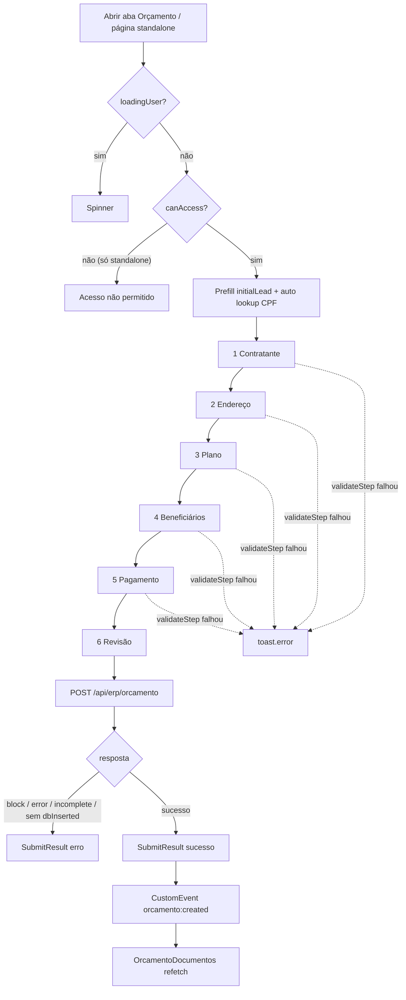
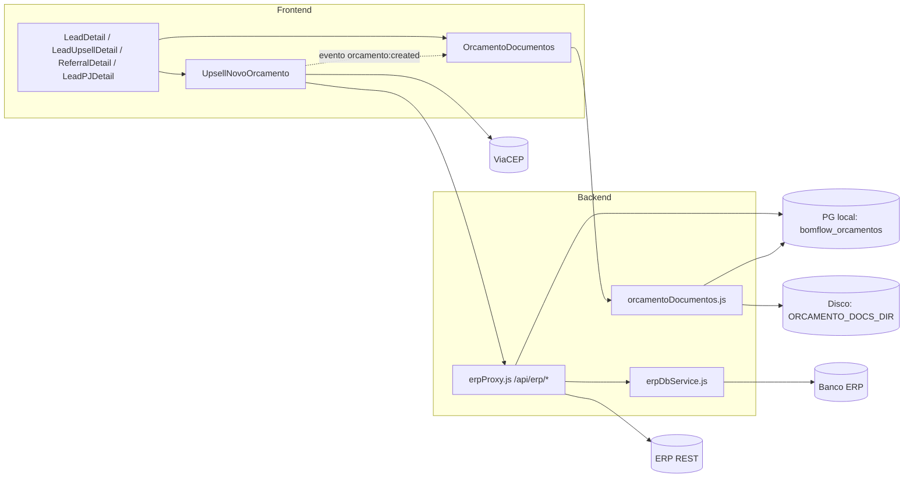
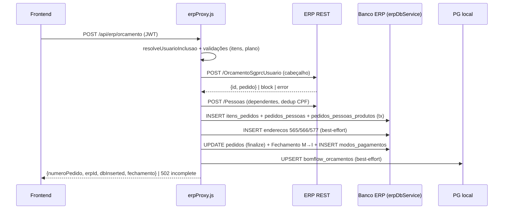
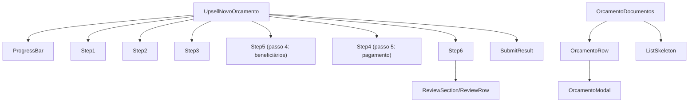
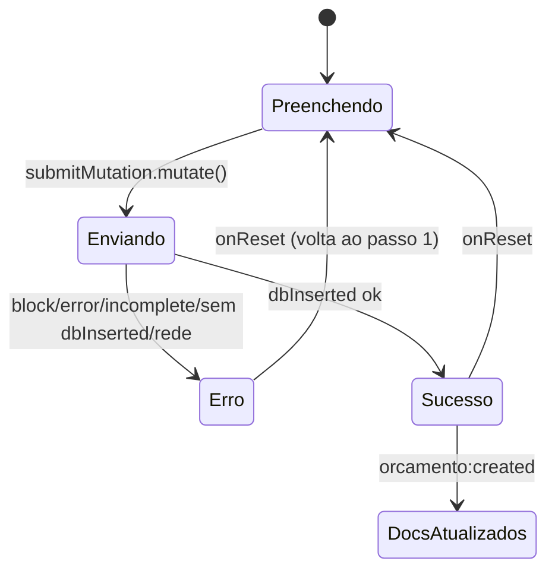

# Auditoria Técnica Completa — Funcionalidade de Orçamento (Bom Flow)

> Documento de auditoria 100% analítico. Nenhum código foi alterado.
> Escopo: componente compartilhado `UpsellNovoOrcamento` (wizard "Novo Orçamento ERP") e a aba de documentos `OrcamentoDocumentos`, usados por Vendas PF, Upsell, Indicações e Vendas PJ.
> Fora do escopo (citados apenas como contexto): páginas de Relatório de Orçamentos (`ErpOrcamentoRelatorioBase` e derivadas) e o formulário legado `ErpOrcamentoForm`.

---

## 1. Visão Geral

### Objetivo e problema de negócio
A funcionalidade permite que um vendedor crie um **orçamento completo no ERP Bom Pastor** (sistema externo) diretamente de dentro do CRM, sem abrir o ERP. O fluxo replica o processo manual do ERP de ponta a ponta: cadastro do contratante, endereço, seleção de produtos/planos, beneficiários (incluindo casos especiais BOM AUTO, BOM PET, COMBO e dependentes), plano de pagamento, **Fechamento (situação "M" → "I")** e registro da guia de pagamento. Depois do envio, a aba "Documentos & Adesão Zero" permite anexar os documentos do cliente (identidade, residência, adesão, contrato) e marcar a flag "Adesão Zero".

### Fluxo completo do usuário (resumo)
1. O vendedor abre a aba **Orçamento** dentro do detalhe de um lead (qualquer um dos 4 módulos) — o formulário já vem pré-preenchido com nome/CPF/telefone/e-mail do lead.
2. Percorre o wizard de **6 passos**: Contratante → Endereço → Plano → Beneficiários → Pagamento → Revisão (`STEPS`, `src/pages/UpsellNovoOrcamento.jsx`).
3. Ao confirmar, o frontend envia um único `POST /api/erp/orcamento`; o backend cria o cabeçalho no ERP via REST, insere itens/beneficiários **direto no banco do ERP**, corrige contatos/endereço, executa Fechamento + Pagamento e registra o orçamento no CRM (`bomflow_orcamentos`).
4. A tela mostra sucesso ou erro detalhado; em caso de sucesso, dispara o evento `orcamento:created` que faz a área de Documentos recarregar e exibir o novo orçamento com os campos de upload e Adesão Zero.

### Pontos de entrada (todos)
| Página | Arquivo | `modulo` | Identificador do cliente passado ao `OrcamentoDocumentos` |
|---|---|---|---|
| Detalhe de lead Vendas PF | `src/pages/LeadDetail.jsx` (TabsContent `orcamento`, ~linha 1085) | `"sales"` | `lead.cpf` |
| Detalhe de lead Upsell | `src/pages/LeadUpsellDetail.jsx` (~linha 1205) | `"sales_upsell"` | `lead.cpf` |
| Detalhe de indicação | `src/pages/ReferralDetail.jsx` (~linha 1020) | `"referral"` | `referral.referredCpf` |
| Detalhe de lead Vendas PJ | `src/pages/LeadPJDetail.jsx` (~linha 1003) | `"sales_pj"` | `lead.cnpj \|\| lead.cpf` |
| Página standalone "Novo Orçamento ERP" | rota registrada em `src/pages/index.jsx` (componente `UpsellNovoOrcamento` sem `embedded`) | `"sales_upsell"` (default) | — (não renderiza `OrcamentoDocumentos`) |

Nos 4 detalhes de lead o componente é montado com `embedded`, `modulo`, `leadId` e `initialLead` (nome, cpf, telefone, email); logo abaixo é montado `OrcamentoDocumentos` com `modulo`, `cpf`, `leadId` e `canManage` calculado na página (ver §12).

Observação PJ: `LeadPJDetail.jsx` passa `initialLead` **sem CPF** (só nome fantasia/razão social, telefone, e-mail) e envia `cnpj || cpf` ao `OrcamentoDocumentos`. O wizard, porém, valida CPF de pessoa física (`isValidCpf`) — na prática o vendedor precisa digitar um CPF válido do contato. Não foi identificado tratamento específico para CNPJ no wizard.

---

## 2. Arquitetura

### Componentes React
- **`UpsellNovoOrcamento`** (`src/pages/UpsellNovoOrcamento.jsx`, export default, ~2265 linhas) — componente "página" que também funciona como componente embutido (prop `embedded`). Contém todo o wizard.
  - Subcomponentes definidos **no mesmo arquivo**: `ProgressBar`, `Step1` (contratante), `Step2` (endereço), `Step3` (plano/produtos), `Step4` (pagamento — renderizado no passo 5), `Step5` (beneficiários — renderizado no passo 4), `Step6` (revisão), `ReviewSection`, `ReviewRow`, `SubmitResult`.
  - Nota de auditoria: os nomes `Step4`/`Step5` estão **invertidos em relação à ordem visual** (o passo 4 da UI renderiza a função `Step5` e o passo 5 renderiza `Step4`) — ver render em ~linhas 1179–1200.
- **`OrcamentoDocumentos`** (`src/components/orcamento/OrcamentoDocumentos.jsx`, 648 linhas) — lista de orçamentos do lead com upload de documentos e flag Adesão Zero. Subcomponentes no mesmo arquivo: `OrcamentoRow`, `OrcamentoModal`, `ListSkeleton`.
- **Componentes UI compartilhados** (shadcn/Radix): `Card*`, `Button`, `Input`, `Label`, `Textarea`, `Badge`, `Select*` de `src/components/ui/*`.

### Gerenciamento de estado
- **Estado do servidor**: React Query (`useQuery` para usuário, produtos ERP e planos de pagamento; `useMutation` para lookup CPF, lookup CEP e envio do orçamento). Não há cache global compartilhado do orçamento — o estado do formulário é 100% local.
- **Estado local** (`useState` em `UpsellNovoOrcamento`): `step`, `form` (objeto com ~23 campos), `produtosSel`, `beneficiarios[]`, `openBenef[]`, `cpfLookup`, `cepLookup`, `submitResult`.
- **Estado local** (`OrcamentoDocumentos`): `orcamentos[]`, `loading`, `busyKey`, `selectedId`; `fileInputs` via `useRef` (inputs de arquivo montados fora do modal para sobreviver a refetch).
- **Sem Context/Provider próprio** — a comunicação entre o wizard e a aba de documentos (componentes irmãos) é feita por **evento DOM global** `orcamento:created` (`window.dispatchEvent` no submit; `window.addEventListener` no `OrcamentoDocumentos`).

---

## 3. Estrutura dos arquivos

```
src/
├── pages/
│   ├── UpsellNovoOrcamento.jsx      # Wizard de 6 passos (página + embutido)
│   ├── LeadDetail.jsx               # Entrada Vendas PF (modulo="sales")
│   ├── LeadUpsellDetail.jsx         # Entrada Upsell (modulo="sales_upsell")
│   ├── ReferralDetail.jsx           # Entrada Indicações (modulo="referral")
│   ├── LeadPJDetail.jsx             # Entrada Vendas PJ (modulo="sales_pj")
│   └── index.jsx                    # Registro de rotas (página standalone)
├── components/
│   ├── orcamento/
│   │   └── OrcamentoDocumentos.jsx  # Documentos + Adesão Zero por orçamento
│   └── ui/…                         # Card, Button, Input, Select… (shadcn)
├── api/base44Client.js              # base44.auth.me() (usuário logado) — NÃO MODIFICAR
└── lib/utils.js, utils/             # cn(), createPageUrl()

backend/src/
├── routes/
│   ├── erpProxy.js                  # /api/erp/* (produtos, planos, lookup-cpf, orcamento…)
│   ├── orcamentoDocumentos.js       # /api/orcamento-documentos/*
│   └── entities.js                  # Migrações (bomflow_orcamentos, orcamento_documentos…)
├── services/
│   └── erpDbService.js              # Escritas/leituras DIRETAS no banco do ERP
└── middleware/
    └── auth.js                      # authMiddleware (JWT)
```

| Arquivo | Responsabilidade | Importado por | Importa (relevante) |
|---|---|---|---|
| `src/pages/UpsellNovoOrcamento.jsx` | Wizard completo do orçamento | 4 páginas de detalhe + rotas em `src/pages/index.jsx` | React Query, react-router, `base44Client`, componentes ui, lucide, sonner |
| `src/components/orcamento/OrcamentoDocumentos.jsx` | Documentos/Adesão Zero por orçamento | 4 páginas de detalhe | lucide, sonner (fetch nativo, sem React Query) |
| `backend/src/routes/erpProxy.js` | Proxy/orquestração ERP | `server` (mount em `/api/erp`) | `erpDbService.js`, `auth.js` |
| `backend/src/services/erpDbService.js` | Acesso direto ao Postgres do ERP (`Pool` dedicado) | `erpProxy.js` | `pg` |
| `backend/src/routes/orcamentoDocumentos.js` | CRUD de documentos + adesão zero | `server` (mount em `/api/orcamento-documentos`) | multer, `auth.js`, pool local |
| `backend/src/routes/entities.js` | Migrações das tabelas locais | boot do servidor | pool local |

---

## 4. Fluxo de execução (do abrir a tela ao orçamento concluído)

1. **Montagem** — a página de detalhe monta `<UpsellNovoOrcamento embedded modulo=… leadId=… initialLead=…/>`. `useQuery(["currentUser"])` chama `base44.auth.me()`; enquanto carrega, spinner (`loadingUser`).
2. **Gate de acesso** — `useCanAccessOrcamento(user)` (linha ~282): admin ou e-mail na allowlist `NOVO_ORCAMENTO_ALLOWED_EMAILS`. **Quando `embedded=true` o gate é ignorado** (`canAccess = embedded ? true : canAccessRaw`, linha ~346) — decisão de produto documentada em comentário.
3. **Pré-preenchimento** — `useEffect` (linha ~351) aplica `initialLead` **uma única vez por lead** (chave em `prefilledKeyRef`), preenchendo `pessoa_contato`, `cpf`, `telefone`, `email_contato`, `whatsapp_do_cliente`. Nunca grava o nome em `contratante_pessoa` (que é o **código ERP** da pessoa).
4. **Auto-lookup de CPF (embutido)** — `useEffect` (linha ~737): como o CPF chega por código (não dispara `onChange`), dispara `lookupCpfMutation` uma vez por CPF válido para resolver `contratante_pessoa` no ERP.
5. **Cargas iniciais** — `useQuery(["erpProdutos"])` → `GET /api/erp/produtos`; `useQuery(["erpPlanosPagamento"])` → `GET /api/erp/planos-pagamento` (ambos `staleTime` 10 min, habilitados só com `canAccess`).
6. **Wizard** — `validateStep()` valida cada passo antes de `handleNext()`; classificadores de produto (`isPetProduto`, `isCondutorProduto`, `isVeiculoProduto`, `isDependenteProduto`, `isDependentePagoProduto`) derivam os modos BOM AUTO / BOM PET / COMBO / dependente pago e os efeitos correspondentes montam/removem cards de beneficiário automaticamente (§7).
7. **Payload** — `payload` (useMemo, linha ~766) monta o corpo com `tipo_pedido: "ORÇAMENTO"`, `nome_estabelecimento: "LIMEIRA - CNPA"` (fixo), itens (produto + beneficiários + flag `registrarPessoa`), plano/parcelas, e metadados CRM `modulo` + `lead_id` (removidos pelo backend antes de ir ao ERP).
8. **Envio** — `submitMutation` → `POST /api/erp/orcamento`. Backend (`backend/src/routes/erpProxy.js`, `router.post('/orcamento')`, linha 840):
   1. Sobrescreve `usuario_inclusao` no servidor via `resolveUsuarioInclusao(req)` (linha 44) — autoria não pode ser forjada pelo cliente.
   2. Valida: ≥1 item, item sem `produtoId` inválido, cada item com ≥1 pessoa, plano de pagamento obrigatório — **antes** de criar o cabeçalho (evita órfãos no ERP).
   3. `POST {ERP_BASE}/OrcamentoSgprcUsuario` (REST do ERP) cria só o **cabeçalho**; resposta com `block`/`error` é repassada.
   4. `resolveDependentePessoas(token, itens)` cadastra dependentes como Pessoa no ERP (`POST /Pessoas`) — fora da transação (HTTP).
   5. `addItemsToPedido(pedidoId, {itens})` (`backend/src/services/erpDbService.js`) — INSERTs diretos no banco do ERP: `itens_pedidos`, `pedidos_pessoas`, `pedidos_pessoas_produtos` (transação com rollback).
   6. `ensureContatosEnderecoDB(...)` (best-effort) corrige contatos/endereço que a API REST grava errado (telefone vira "comercial" 573; endereço some) — INSERTs em `enderecos` (tipos 565/566/577).
   7. `finalizeOrcamentoDB(...)` preenche `pedidos.endereco_id`, `dia_vencimento`, `email_contato`.
   8. `applyFechamentoEPagamento(pedidoId, {planoPagamentoId, quantidadeParcelas})` — muda `pedidos.situacao` M→I e insere a guia em `modos_pagamentos`.
   9. `recordBomflowOrcamento(...)` (linha ~799, best-effort) faz UPSERT em `bomflow_orcamentos` (rastreio CRM por módulo/agente/lead).
   10. Resposta de sucesso: `{...data, numeroPedido, erpId, dbInserted, fechamento}`.
9. **Pós-envio (frontend)** — `submitMutation.onSuccess` trata como **erro** qualquer resposta com `block`, `error`, `dbWarning`, `incomplete` ou sem `dbInserted` (defesa contra falha parcial silenciosa). Sucesso → `SubmitResult` verde + `window.dispatchEvent(new CustomEvent("orcamento:created", {detail:{modulo}}))`.
10. **Documentos** — `OrcamentoDocumentos` escuta `orcamento:created`, refaz `GET /api/orcamento-documentos/orcamentos?modulo=&cpf=&lead_id=` e exibe o orçamento com os 4 slots de documento + toggle Adesão Zero.

---

## 5. APIs utilizadas

Autenticação de todas as rotas internas: header `Authorization: Bearer <accessToken do localStorage>`; backend valida com `authMiddleware` (`backend/src/middleware/auth.js`). Não foram identificados timeout customizado nem retries nos `fetch` do frontend (usa defaults do navegador); um interceptor global de fetch renova o access token expirado (feature "Token Management" do projeto).

### 5.1 Internas (backend Express)
| Endpoint | Método | Chamada em | Backend | Observações |
|---|---|---|---|---|
| `/api/erp/produtos` | GET | `useQuery(["erpProdutos"])` | `backend/src/routes/erpProxy.js` ~linha 1126 → ERP `API_MV_API_PRODUTOS` | Lista completa de produtos ERP; cache React Query 10 min |
| `/api/erp/planos-pagamento` | GET | `useQuery(["erpPlanosPagamento"])` | `erpProxy.js` ~linha 1113 → `getPlanosPagamento` (`erpDbService.js`, SQL direto: `SELECT … FROM planos_pagamentos WHERE situacao='A' …`) | Planos ativos |
| `/api/erp/lookup-cpf?cpf=` | GET | `lookupCpfMutation` (linha ~712) e auto-lookup embutido | `erpProxy.js` ~linha 736: tenta `GET /Pessoas?cpf=` no ERP, fallback `GET /API_CADASTRO_PESSOAS?cpf=` | Retorna `{pessoa, nome, cpf}`; "não encontrado" vira estado amarelo (preencher manualmente) |
| `/api/erp/orcamento` | POST | `submitMutation` (linha ~831) | `erpProxy.js` linha 840 (fluxo completo do §4.8) | Erros parciais retornam HTTP 502 com `incomplete:true` |
| `/api/orcamento-documentos/orcamentos?modulo=&cpf=&lead_id=` | GET | `fetchOrcamentos` (`OrcamentoDocumentos.jsx`) | `orcamentoDocumentos.js` linha 112 | Lista orçamentos do lead com docs; lookup best-effort no ERP p/ nome do produto (`getProdutosByPedidoIds`) |
| `/api/orcamento-documentos` | POST (multipart) | `handleUpload` | linha 254; multer 15 MB, tipos pdf/jpg/jpeg/png + validação de magic bytes (`validateMagicBytes`, linha 47) | Substitui doc anterior do mesmo tipo em transação |
| `/api/orcamento-documentos/:id/download` | GET | `handleView` | linha 328; exige `canManage` | Stream do arquivo; frontend abre blob em nova aba |
| `/api/orcamento-documentos/:id` | DELETE | `handleDelete` | linha 348; exige `canManage` | Remove registro + arquivo |
| `/api/orcamento-documentos/adesao-zero` | PUT | `handleAdesaoZero` | linha 365; exige `canManage` | `UPDATE bomflow_orcamentos SET adesao_zero=` |
| `/api/orcamento-documentos/by-pedido/:erpPedidoId` | GET | (rota existente, não usada por este componente) | linha 197 | — |

### 5.2 Externas
| API | Onde | Detalhes |
|---|---|---|
| **ERP Bom Pastor REST** — base `http://erp.wescctech.com.br:8080/BOMPASTOR/api` (`ERP_BASE` em `erpProxy.js`) | backend | Token via `process.env.ERP_AUTH_TOKEN` (helper `getToken`). Endpoints usados no fluxo: `OrcamentoSgprcUsuario` (POST cabeçalho), `Pessoas` (GET lookup / POST criação de dependente), `API_CADASTRO_PESSOAS` (GET fallback), `API_MV_API_PRODUTOS` (GET produtos). Sem retries; erros repassados. |
| **Banco PostgreSQL do ERP** (pool separado em `erpDbService.js`) | backend | Ver §6.2. É a via principal de escrita real: a API REST do ERP salva só o cabeçalho e ignora/corrompe vários campos. |
| **ViaCEP** — `https://viacep.com.br/ws/{cep}/json/` | **frontend direto** (`lookupCepMutation`, linha ~746) | Sem autenticação; sem proxy pelo backend; `data.erro` → "CEP não encontrado". |

---

## 6. Banco de dados

### 6.1 PostgreSQL local (CRM) — migrações em `backend/src/routes/entities.js`
- **`bomflow_orcamentos`** — rastreio CRM de cada orçamento criado: `erp_pedido_id` (BIGINT, UNIQUE), `erp_numero`, `modulo` (VARCHAR), `agent_id` (UUID), `agent_name`, `cliente_nome`, `cliente_cpf`, `valor`, `adesao_zero` (BOOLEAN), `lead_id` (UUID). Índices em `modulo`, `agent_id`, `lead_id`. Escrita: UPSERT em `recordBomflowOrcamento` (`erpProxy.js` ~linha 808, `ON CONFLICT` com `lead_id = COALESCE(EXCLUDED.lead_id, …)`), marcado como **não crítico** (falha só loga). Sem `modulo` válido o orçamento **não é rastreado** (warn na linha 799).
- **`orcamento_documentos`** — metadados dos anexos: `erp_pedido_id` (BIGINT), `lead_id`, `modulo`, `tipo` (identidade | residencia | adesao | contrato), `stored_name` (UUID), `original_name`, `mime_type`, `size_bytes`, `uploaded_by` (UUID), `created_at`. Índice único `(erp_pedido_id, tipo)` — 1 documento por tipo por orçamento.
- Arquivos físicos: disco local em `process.env.ORCAMENTO_DOCS_DIR` (default `backend/data/orcamento-documentos`) — **não** usa Object Storage.

### 6.2 Banco do ERP (escritas/leituras diretas — `backend/src/services/erpDbService.js`)
| Tabela ERP | Operação | Função | Papel |
|---|---|---|---|
| `itens_pedidos` | INSERT | `addItemsToPedido` (~linha 450) | 1 linha por produto (`sequencia`, `produto_id`, `quantidade`, `preco`, `valor_total_item`) |
| `pedidos_pessoas` | INSERT | `addItemsToPedido` | Beneficiários (`nome_pessoa`, `cpf`, `parentesco`, `data_nascimento`, `sexo`, `pessoa_id`) |
| `pedidos_pessoas_produtos` | INSERT | `addItemsToPedido` | Junção item ↔ pessoa |
| `enderecos` | INSERT | `ensureContatosEnderecoDB` | Contatos/endereço (tipos 565=telefone, 566=celular/e-mail, 577=endereço físico) que a REST ignora/grava errado |
| `pedidos` | UPDATE | `finalizeOrcamentoDB`, `applyFechamentoEPagamento` | `endereco_id`, `dia_vencimento`, `email_contato`; depois `situacao` M→I |
| `modos_pagamentos` | INSERT | `applyFechamentoEPagamento` | Guia de pagamento do fechamento |
| `planos_pagamentos` | SELECT | `getPlanosPagamento` | Planos ativos p/ o passo Pagamento |
| `pessoas` / `documentos_pessoas` | via REST + consultas de apoio (`findPessoaIdByCpf`) | `resolveDependentePessoas` (em `erpProxy.js`) + `erpDbService` | Dependentes viram Pessoa global; dedup por CPF (CPF em `documentos_pessoas` tipo 580) |

Não foram identificadas views ou stored procedures próprias — toda a lógica é SQL direto nas funções acima.

---

## 7. Regras de negócio

### Validações por passo (`validateStep`, `UpsellNovoOrcamento.jsx` ~linha 889)
- **Passo 1 (Contratante):** CPF válido (dígitos verificadores, `isValidCpf`), nome, telefone e e-mail (regex) obrigatórios; celular opcional mas, se preenchido, precisa ser móvel (DDD + 9 dígitos, `isMobilePhone`). Aviso fixo: celular/sexo/estado civil/profissão são exigidos no **fechamento** do ERP.
- **Passo 2 (Endereço):** CEP com 8 dígitos; logradouro, número, bairro e cidade obrigatórios.
- **Passo 3 (Plano):** título do contrato obrigatório (lista fixa `TITULO_CONTRATO_OPTIONS`, 19 títulos); ≥1 produto; preço > 0 para produtos do titular (produtos de beneficiário usam preço padrão do ERP).
- **Passo 4 (Beneficiários):** BOM AUTO exige nome do condutor; card de veículo exige modelo, cor, placa válida (antiga `AAA9999` ou Mercosul `AAA9A99`, `placaValida`) e ano com 4 dígitos; BOM PET exige todos os campos do pet (nome/tipo/raça/cor/porte — `montarNomePet` retorna "" se faltar algo); dependente pago exige nome + CPF válido + data de nascimento; beneficiário comum com nome exige CPF válido e produto atribuído; **todo item precisa de ≥1 pessoa** (senão o Fechamento falha no ERP).
- **Passo 5 (Pagamento):** plano de pagamento e quantidade de parcelas (≥1) obrigatórios.
- Limite de **15 beneficiários** (`addBeneficiario`; backend também trunca com `.slice(0, 15)` por item).

### Classificação de produtos (frontend, linhas ~148–183)
- **Pet**: descrição contém "NOME DO PET" (`isPetProduto`).
- **Condutor / Veículo**: "DADOS DO CONDUTOR" / "DADOS DO VEÍCULO" (`isCondutorProduto`/`isVeiculoProduto`).
- **Dependente vaga (0,01)**: "DEPENDENTE" + preço ≈ 0,01 (`isDependenteProduto`) — só produto de beneficiário.
- **Dependente pago (> 0,01)**: "DEPENDENTE" + preço real (`isDependentePagoProduto`) — item do **titular**, mas com card automático de beneficiário obrigatório e `incluir_titular` desligado (quantidade = nº de dependentes; modelo confirmado no pedido ERP 68923, comentário na linha ~173).

### Modos especiais
- **BOM AUTO puro**: título traz condutor + veículo → 2 cards fixos, produto bloqueado (effect linha ~577, controlado por `bomAutoSetupRef`).
- **COMBO**: título traz só o veículo; o condutor é **pareado** buscando na lista completa do ERP o produto "DADOS DO CONDUTOR" da mesma variante, e o card nasce pré-preenchido com os dados do **titular** — no fechamento, o dedup por CPF no backend reaproveita a pessoa real e evita contrato BOM AUTO em branco (effect linha ~600).
- **BOM PET**: modo ativado quando o titular escolhe plano "BOM PET" e o contrato tem produto de pet; o produto de pet (variante SAÚDE ou padrão, `petBenefProdutoId`) é atribuído automaticamente aos cards (effects linhas ~546–681). Nome enviado ao ERP no formato `NOME/TIPO/RAÇA/COR/PORTE`.
- **Veículo**: nome enviado como `MODELO/COR/PLACA/ANO` (`montarNomeVeiculo`).

### Regras financeiras
- Quantidade do item = (titular incluído ? 1 : 0) + beneficiários nomeados atribuídos (`qtyForProduto`, linha ~476). Total do item = preço × quantidade; `grandTotal` = soma dos itens. Exibição com `toFixed(2)`; **não há descontos nem arredondamentos especiais no frontend**.
- Backend: plano de pagamento **obrigatório** — o fluxo sempre termina no Fechamento (M→I) + pagamento; sem plano o orçamento ficaria parado em "M" (validação na linha 897 de `erpProxy.js`).

### Regras de integridade no backend (`erpProxy.js` POST /orcamento)
- `usuario_inclusao` sempre resolvido no servidor (anti-fraude de autoria).
- Validações de itens/plano **antes** de criar o cabeçalho (evita órfão no ERP).
- Falha em qualquer etapa pós-cabeçalho → **HTTP 502 com mensagem explícita** ("orçamento INCOMPLETO", "ficou em M") — nunca sucesso silencioso; o ERP não é revertido automaticamente.

---

## 8. Integrações

- **ERP Bom Pastor** (REST + banco direto) — ver §5.2/§6.2. É a única integração de escrita do fluxo.
- **ViaCEP** — consulta de endereço, direto do navegador.
- **Uploads** — multer em memória + disco local (`ORCAMENTO_DOCS_DIR`); validação de extensão, MIME e magic bytes.
- **Não há** no fluxo de orçamento: WhatsApp/WHU, webhooks, geração de PDF, envio de e-mail, Object Storage (o projeto usa essas integrações em outros módulos).

---

## 9. Componentes visuais

### `UpsellNovoOrcamento`
- **Spinner de página** enquanto `loadingUser`.
- **Tela "Acesso não permitido"** (ícone `XCircle` + botão voltar) quando `canAccess === false` (só standalone).
- **Cabeçalho** "Novo Orçamento ERP" — só quando **não** embutido.
- **`ProgressBar`** — 6 chips com estado feito/ativo/pendente (labels ocultos em telas pequenas).
- **Card do passo atual** com ícone e título; navegação Voltar/Próximo; no passo 6 o botão vira "Confirmar e Enviar ao ERP" com spinner "Enviando ao ERP…" durante `submitMutation.isPending`.
- **Passo 1**: inputs com máscaras (CPF, celular), spinner/check no campo CPF conforme `lookupCpfMutation`, mensagens verde ("Encontrado no ERP: {nome}") / âmbar ("Não encontrado — preencha manualmente"), banner âmbar sobre campos do fechamento.
- **Passo 2**: CEP com spinner/check, erro vermelho "CEP não encontrado"; campos uppercase automáticos.
- **Passo 3**: select de título; lista rolável de produtos com checkbox, preço editável e toggle "incluir titular"; estados loading/vazio; resumo com total.
- **Passo 4 (beneficiários)**: cards colapsáveis (chevron), badges ("Principal", "Condutor", "Dependente", parentesco), variantes de formulário por tipo (comum/veículo/pet), produto read-only nos cards automáticos, botão/borda tracejada "Adicionar beneficiário" (até 15), lixeira nos removíveis, preview "Será enviado ao ERP como: …".
- **Passo 5 (pagamento)**: selects de plano, parcelas (1–12x), dia de vencimento (01–25), observações.
- **Passo 6 (revisão)**: banner de aviso irreversibilidade + `ReviewSection`s (Contratante, Endereço, Plano e Produtos com linha por item e total).
- **`SubmitResult`**: painel de sucesso (número do pedido) ou erro (mensagem + detalhes), com botão de reiniciar o wizard.

### `OrcamentoDocumentos`
- Card "Documentos & Adesão Zero" com contador de orçamentos e botão "Atualizar" (ícone girando durante load).
- `ListSkeleton` no primeiro carregamento; empty-state "Nenhum orçamento encontrado…".
- `OrcamentoRow` por orçamento (clique abre `OrcamentoModal`); modal com os 4 tipos de documento (`DOC_TIPOS`: identidade, residência, adesão, contrato) — upload/visualizar/excluir por tipo — e toggle Adesão Zero; ações desabilitadas conforme `busyKey` e `canManage`.
- Inputs `type="file"` ocultos montados **fora** do modal (comentário na linha ~612: sobrevivem ao refetch).

---

## 10. Eventos

| Evento | Onde | Efeito |
|---|---|---|
| `onChange` CPF (Step1 `handleCpfChange`) | linha ~1280 | Máscara + limpa lookup + dispara `lookupCpfMutation` quando completa 11 dígitos válidos |
| `onChange` CEP (Step2 `handleCepChange`) | linha ~1440 | Máscara + dispara ViaCEP com 8 dígitos |
| `onChange` demais inputs/selects | Steps 1–5 | `set(k,v)` / `setBenef` / `setVeiculoField` / `setPetField` (estes dois recalculam `usua_nome_completo`) |
| Checkbox produto (`toggleProduto`) | linha ~683 | Adiciona/remove item; ao remover, desvincula beneficiários do produto |
| Clique no cabeçalho do card de beneficiário | `toggleBenef` | Expande/colapsa |
| Botões Voltar/Próximo/Enviar | `handleBack`/`handleNext`/`submitMutation.mutate()` | Navegação validada / envio |
| **`orcamento:created`** (CustomEvent global) | disparado no `submitMutation.onSuccess`; ouvido em `OrcamentoDocumentos` (`window.addEventListener`) | Refetch da lista de orçamentos |
| Upload (`onChange` do input file) | `OrcamentoDocumentos` linha ~623 | `handleUpload(orc, tipo, file)`; `e.target.value=""` permite re-selecionar o mesmo arquivo |
| Visualizar/Excluir/Adesão Zero | `handleView`/`handleDelete` (com `window.confirm`)/`handleAdesaoZero` | Chamadas às rotas de documentos |
| Atalhos de teclado | — | **Não há** atalhos customizados |

Principais `useEffect` (todos em `UpsellNovoOrcamento.jsx`): prefill do lead (~351), auto-lookup CPF embutido (~737), montagem dos cards BOM AUTO (~577), pareamento condutor COMBO (~600), sincronização de cards de dependente pago (~634), atribuição automática de produto pet (~663).

---

## 11. Hooks

| Hook | Tipo | Responsabilidade |
|---|---|---|
| `useCanAccessOrcamento(user)` | custom (mesmo arquivo, ~282) | Gate da página standalone (admin ou allowlist). Nota: apesar do nome, não usa hooks internos — é uma função pura chamada no corpo do componente. |
| `useQuery(["currentUser"])` | React Query | Usuário logado via `base44.auth.me()` |
| `useQuery(["erpProdutos"])` / `useQuery(["erpPlanosPagamento"])` | React Query | Catálogos do ERP; `staleTime` 10 min; `enabled: !!canAccess` |
| `lookupCpfMutation` / `lookupCepMutation` / `submitMutation` | `useMutation` | Lookup CPF no ERP / ViaCEP / envio do orçamento |
| `useMemo` (≈15 usos) | React | Derivações: `produtosFiltrados`, `produtoVeiculo`, `produtoCondutor`, `produtosTitular`, `produtosBeneficiario`, `dependentePago*`, `benefItens`, `itensSel`, `produtosResumo`, `grandTotal`, `opcoesBenefProduto`, `petProdutoIds`, `isBomPet`, `petBenefProdutoId`, `planoSelecionado`, `payload` |
| `useRef` | React | `prefilledKeyRef` (prefill único), `autoLookupCpfRef` (lookup único), `bomAutoSetupRef` (setup único), `fileInputs` (docs) |
| `useNavigate` | react-router | Voltar ao Kanban Upsell (standalone) |

`OrcamentoDocumentos` não usa React Query — gerencia fetch manualmente com `useState`/`useEffect` (incluindo o listener de `orcamento:created`).

---

## 12. Permissões (RBAC)

### Frontend
- **Página standalone**: `user.role === "admin"` OU e-mail em `NOVO_ORCAMENTO_ALLOWED_EMAILS = ["teste3@bomflow.com", "bomflow4@wescctech.com.br"]` (`UpsellNovoOrcamento.jsx` linha 280).
- **Embutido**: liberado para **todos** os usuários autenticados (linha 346 — decisão de produto).
- **`canManage` dos documentos** (calculado na página de detalhe, apenas cosmético no frontend): admin || supervisor || dono do lead (ex.: `LeadDetail.jsx` linha 1101; equivalentes nas outras 3 páginas).

### Backend (fonte de verdade)
- Todas as rotas exigem JWT (`authMiddleware`).
- `POST /api/erp/orcamento`: qualquer usuário autenticado; autoria forçada por `resolveUsuarioInclusao` (prefere o login nativo do ERP vinculado ao `erp_agent_id`, fallback pelo e-mail do JWT).
- Documentos (`orcamentoDocumentos.js`): `canManage(req, erpPedidoId)` (linha 80) — privilegiado (admin etc.) **ou** `bomflow_orcamentos.agent_id === req.user.id`. Aplicado em download (333), delete (353) e adesão-zero (371). O upload valida dono/privilegiado na própria rota (linha 274). O GET de listagem aplica `ownerFilter` por `agent_id` para não-privilegiados (linha 126).
- **Feature flags**: não há flags formais; a allowlist de e-mails funciona como flag manual.

---

## 13. Tratamento de erros

- **Validação de passo**: `toast.error` específico por campo; navegação bloqueada.
- **Lookup CPF**: erro → estado "notfound" âmbar (não bloqueia — permite preencher manualmente).
- **CEP**: `data.erro` do ViaCEP → mensagem vermelha; não bloqueia digitação manual.
- **Submit**: `onSuccess` inspeciona a resposta e converte em erro qualquer um de: HTTP não-ok, `data.block` (bloqueio de regra do ERP), `data.error`, `data.dbWarning`/`data.incomplete` (falha parcial), ausência de `dbInserted` (linha ~844–873). `onError` captura falha de rede. Tudo cai em `SubmitResult` tipo `error` com a mensagem + payload de diagnóstico.
- **Backend**: erros de cada etapa retornam 502 com mensagens operacionais explícitas ("está INCOMPLETO", "ficou em M e precisa ser fechado manualmente"), incluindo `pedido`/`erpId` para correção manual; exceção geral → 500. `ensureContatosEnderecoDB` e `recordBomflowOrcamento` são best-effort (só logam).
- **Documentos**: toasts por operação; upload rejeita tipo/tamanho/magic-bytes; 403 "Sem permissão" quando `canManage` falha no servidor.
- **Timeouts/retries**: não implementados explicitamente em nenhuma chamada (não determinável além dos defaults de `fetch`/undici).
- **Autenticação**: 401 tratado pelo interceptor global de refresh de token (fora destes arquivos).

---

## 14. Performance

- **Cache**: React Query com `staleTime` 10 min para produtos e planos (evita refetch a cada troca de aba do wizard).
- **Memoização**: uso extensivo de `useMemo` para derivações caras (filtros de produto, payload); `useRef` para efeitos idempotentes (prefill, auto-lookup, setup BOM AUTO).
- **Debounce/throttle**: **não há** — o lookup de CPF/CEP dispara apenas quando o campo completa o tamanho exato (11/8 dígitos), o que na prática limita as chamadas.
- **Lazy loading / code splitting**: não identificado para estes componentes (importados estaticamente pelas 4 páginas de detalhe — o wizard de ~2265 linhas entra no bundle das páginas).
- **Virtualização**: não há; a lista de produtos usa `max-h-72 overflow-y-auto` simples.
- Ponto de atenção: `useQuery(["erpProdutos"])` baixa a lista **completa** de produtos do ERP para filtrar no cliente.

---

## 15. Dependências (bibliotecas)

| Biblioteca | Uso no fluxo |
|---|---|
| `@tanstack/react-query` | Queries (usuário, produtos, planos) e mutations (lookup/submit) |
| `react-router-dom` | `useNavigate`, `createPageUrl` (navegação standalone) |
| `sonner` | Toasts de validação/erro/sucesso |
| `lucide-react` | Ícones |
| `date-fns` + `ptBR` | Formatação de datas (`OrcamentoDocumentos`/páginas de detalhe) |
| Radix UI / shadcn (`components/ui/*`) | Card, Button, Input, Select, Badge, Textarea, Label |
| `base44Client` (`src/api/base44Client.js`) | `auth.me()` — arquivo protegido, não modificar |
| Backend: `express`, `pg` (2 pools: local + ERP), `multer`, `jsonwebtoken` | Rotas, bancos, upload, JWT |

---

## 16. Fluxo completo dos dados

```
Interface (wizard 6 passos)
  → estado local (form, produtosSel, beneficiarios)
  → useMemo payload (itens + metadados modulo/lead_id)
  → submitMutation (fetch POST /api/erp/orcamento, Bearer JWT)
    → erpProxy.js: resolveUsuarioInclusao → validações
    → ERP REST POST /OrcamentoSgprcUsuario (cabeçalho)
    → ERP REST POST /Pessoas (dependentes)
    → erpDbService: INSERT itens_pedidos / pedidos_pessoas / pedidos_pessoas_produtos (transação)
    → erpDbService: INSERT enderecos (565/566/577) [best-effort]
    → erpDbService: UPDATE pedidos (finalize) → Fechamento M→I + INSERT modos_pagamentos
    → UPSERT bomflow_orcamentos (rastreio CRM) [best-effort]
  ← {numeroPedido, erpId, dbInserted, fechamento}
  → SubmitResult (sucesso/erro) + toast
  → CustomEvent "orcamento:created"
    → OrcamentoDocumentos.fetchOrcamentos → GET /api/orcamento-documentos/orcamentos
      → SELECT bomflow_orcamentos + orcamento_documentos (+ lookup ERP do produto)
    → UI atualiza lista com slots de documentos + Adesão Zero
```

---

## 17. Diagramas Mermaid

### 17.1 Fluxo da página (wizard)


### 17.2 Arquitetura


### 17.3 Fluxo do POST /api/erp/orcamento


### 17.4 Fluxo dos componentes


### 17.5 Fluxo dos estados (submit)


---

## 18. Pontos críticos

1. **Falha parcial sem rollback no ERP** — se o cabeçalho é criado mas itens/fechamento falham, o orçamento fica órfão/incompleto ou parado em "M" no ERP e exige correção **manual**. Mitigado por mensagens explícitas e status 502, mas o risco operacional permanece (`erpProxy.js` linhas 947–1014).
2. **Dependência de escrita direta no banco do ERP** — a REST do ERP só grava o cabeçalho; itens, pessoas, endereço, fechamento e pagamento são INSERTs/UPDATEs diretos (`erpDbService.js`). Qualquer mudança de schema no ERP quebra o fluxo silenciosamente.
3. **Classificação de produtos por regex de descrição** — "NOME DO PET", "DADOS DO CONDUTOR/VEÍCULO", "DEPENDENTE" + faixas de preço (0,01 vs > 0,015). Renomear um produto no ERP muda o comportamento do wizard sem aviso.
4. **Componente monolítico** — `UpsellNovoOrcamento.jsx` tem 2265 linhas com regras de negócio, efeitos encadeados sobre `beneficiarios` (BOM AUTO, COMBO, dependente pago, BOM PET) e UI no mesmo arquivo; efeitos que se alimentam do próprio estado que alteram são o ponto mais frágil (risco de loops/condições de corrida em edge cases).
5. **Nomes trocados `Step4`/`Step5`** vs. ordem visual — armadilha de manutenção documentada apenas pela ordem do render.
6. **`nome_estabelecimento` fixo** (`"LIMEIRA - CNPA"`, linha 145) — hardcoded; não determinável no código se isso é correto para todos os módulos/filiais.
7. **Vendas PJ usa um wizard PF** — sem campo CNPJ, validação exige CPF; `OrcamentoDocumentos` recebe `cnpj || cpf` enquanto o orçamento é criado com o CPF digitado, podendo desalinhar a busca por CPF na listagem de documentos (a busca por `lead_id` cobre o caso).
8. **Rastreio CRM best-effort** — falha no UPSERT de `bomflow_orcamentos` só gera log; o orçamento existe no ERP mas some dos relatórios/documentos do CRM (sem doc slots), sem aviso ao vendedor.
9. **ViaCEP direto do navegador** — dependência externa sem proxy/fallback; se o serviço cair, resta digitação manual (funciona, mas sem aviso além do erro).
10. **Uploads em disco local** — documentos ficam no filesystem do servidor (`ORCAMENTO_DOCS_DIR`), não em Object Storage; deploys/containers efêmeros podem perder arquivos (não determinável neste escopo como o deploy persiste esse diretório).
11. **Allowlist hardcoded** de e-mails para a página standalone — gestão de acesso via código, não via RBAC.
12. **Sem timeout/retry** nas chamadas ao ERP — uma lentidão do ERP segura a requisição e o vendedor sem feedback além do spinner.

---

## 19. Resumo executivo

- **Objetivo**: criar orçamentos completos no ERP Bom Pastor a partir do CRM, com fechamento e pagamento automáticos, e gerenciar os documentos do orçamento (identidade, residência, adesão, contrato) + flag Adesão Zero.
- **Tecnologias**: React 18 + React Query + Radix/shadcn + Tailwind (frontend); Express + `pg` com **dois bancos** (PostgreSQL local do CRM e banco do ERP via pool dedicado) + multer (backend).
- **APIs**: 4 rotas internas `/api/erp/*` e 5+ rotas `/api/orcamento-documentos/*`; externas: ERP REST (`OrcamentoSgprcUsuario`, `Pessoas`, `API_MV_API_PRODUTOS`), banco do ERP direto e ViaCEP.
- **Regras principais**: wizard de 6 passos com validação por passo; classificação de produtos por descrição/preço (pet, condutor, veículo, dependente vaga/pago); modos BOM AUTO / BOM PET / COMBO com cards automáticos; plano de pagamento obrigatório com Fechamento M→I; máximo 15 beneficiários; qualquer falha parcial é tratada como erro visível.
- **Permissões**: JWT em tudo; página standalone restrita a admin + allowlist; embutido liberado; documentos controlados no backend por dono do orçamento (`bomflow_orcamentos.agent_id`) ou perfil privilegiado.
- **Complexidade**: alta — concentrada no componente de 2265 linhas e na orquestração backend de 8 etapas (REST + 3 tabelas de itens/pessoas + endereços + fechamento + pagamento + rastreio CRM).
- **Pontos críticos**: ausência de rollback no ERP em falha parcial, acoplamento a escrita direta no banco do ERP e a descrições de produto, monólito frontend, uploads em disco local e falta de timeouts (§18).
