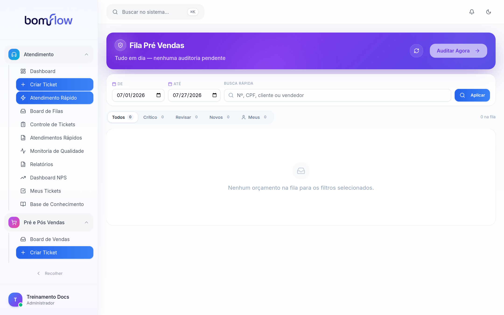
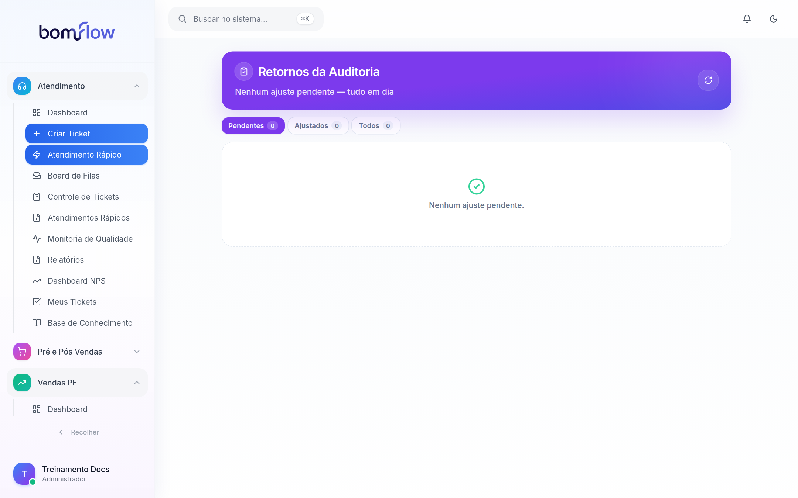
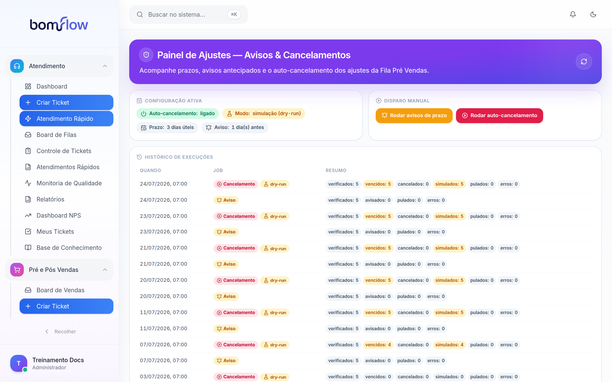
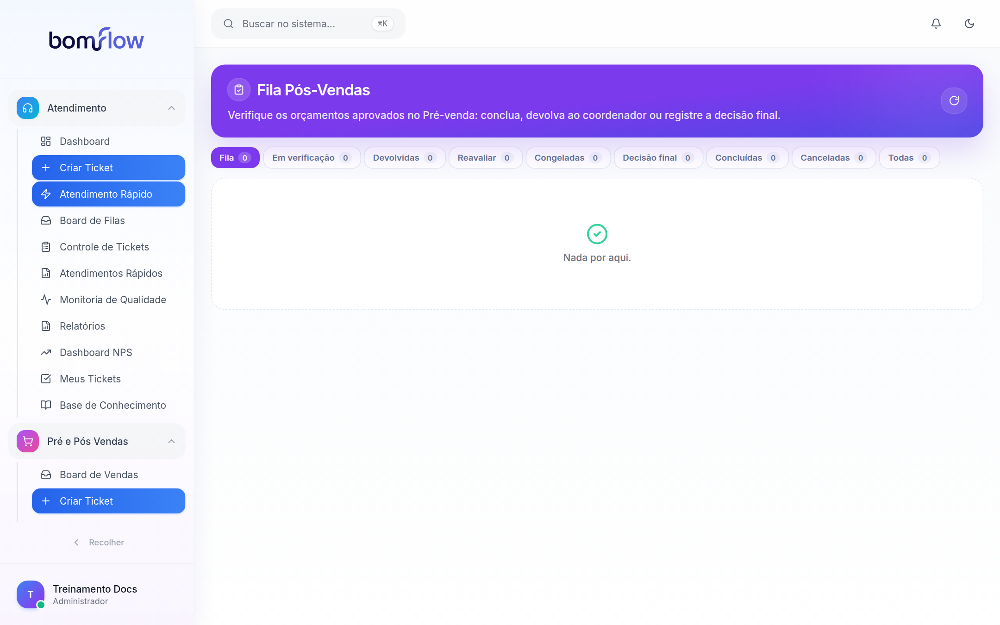
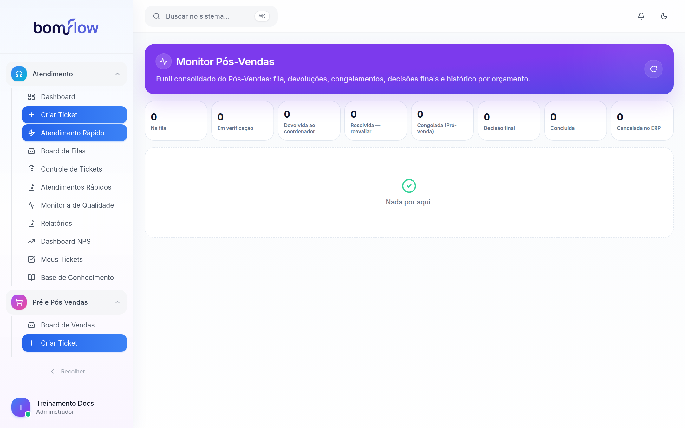
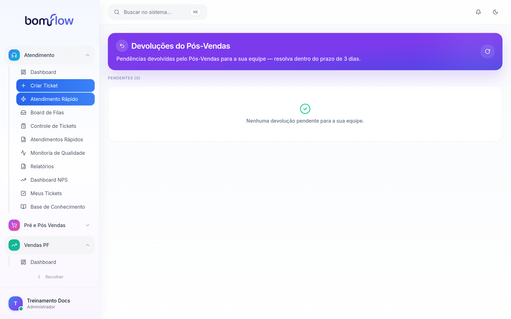
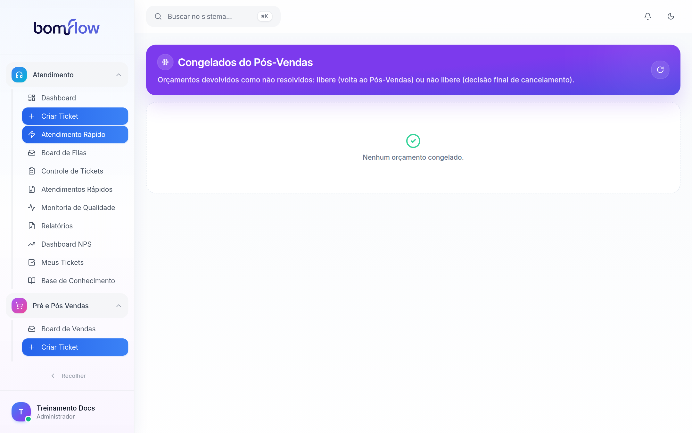

# Manual de Treinamento — Módulo Pré-Vendas (Auditoria) e Pós-Vendas

**Bom Flow · Material de distribuição interna** · Versão 1.0 · Julho/2026

Este manual ensina, passo a passo, como operar o módulo de **Pré-Vendas (auditoria de orçamentos)** e de **Pós-Vendas (verificação final)** do Bom Flow. Ele é voltado a quatro públicos:

| Público | O que faz no módulo |
|---|---|
| **Auditor (Pré-venda)** | Audita orçamentos emitidos no ERP, solicita ajustes, aprova e decide sobre congelados |
| **Vendedor** | Recebe e corrige os ajustes solicitados pela auditoria |
| **Supervisor / Coordenador** | Acompanha prazos, resolve devoluções do Pós-Vendas da sua equipe |
| **Auditor do Pós-Vendas** | Verifica os orçamentos aprovados, conclui, devolve, congela ou cancela no ERP |
| **Administrador** | Tudo acima + dispara jobs manuais e acompanha o painel de Avisos & Cancelamentos |

---

## 1. Visão geral do ciclo completo

Todo orçamento nasce no **ERP** (emitido pelos módulos de venda do Bom Flow — Vendas PF, Vendas PJ, Upsell ou Indicações). A partir daí ele percorre duas camadas de controle de qualidade antes de ser considerado concluído:

```
                         CICLO COMPLETO DO ORÇAMENTO
┌───────────────┐
│ ERP           │  Venda registrada (situação "I" — Emitido/Análise)
│ (orçamento)   │
└──────┬────────┘
       ▼
┌───────────────────────────── PRÉ-VENDAS (AUDITORIA) ────────────────────────────┐
│  Fila Pré Vendas → auditor ASSUME o orçamento (trava: 1 auditor por orçamento)  │
│      │                                                                          │
│      ├── Checklist OK ──────────► APROVAR ───────────────────────────┐          │
│      │                                                               │          │
│      └── Falta algo ──► SOLICITAR AJUSTE ──► vendedor corrige        │          │
│                              │   (tela "Retornos da Auditoria")      │          │
│                              │   Prazo: 3 dias úteis                 │          │
│                              ├── ajustou → volta à fila da auditoria │          │
│                              └── venceu  → auto-cancelamento         │          │
│                                            (painel Avisos & Canc.)   │          │
└──────────────────────────────────────────────────────────────────────┼──────────┘
                                                                       ▼
┌────────────────────────────────── PÓS-VENDAS ───────────────────────────────────┐
│  Fila Pós-Vendas → auditor ASSUME a verificação (status "Em verificação")       │
│      │                                                                          │
│      ├── Tudo certo ─────────────► CONCLUIR (fim: "Concluída")                  │
│      │                                                                          │
│      └── Problema ──► DEVOLVER ao coordenador (motivo + prazo de 3 dias)        │
│                            │  (tela "Devoluções do Pós-Vendas")                 │
│                            ├── coordenador RESOLVE → volta p/ reavaliação       │
│                            │        ├── OK agora → CONCLUIR                     │
│                            │        └── não resolvido → CONGELAR                │
│                            └── (congelada vai p/ tela "Congelados")             │
│                                                                                 │
│  Congelados (equipe do Pré-venda decide):                                       │
│      ├── LIBERAR → volta à fila do Pós-Vendas                                   │
│      └── NÃO LIBERAR → "Decisão final" → auditor do Pós-Vendas                  │
│                         CANCELA o pedido DE VERDADE no ERP (situação "C")       │
└──────────────────────────────────────────────────────────────────────────────────┘
```

**Regra de ouro:** até a decisão final, nada é alterado no ERP. A aprovação do Pré-venda e todo o fluxo do Pós-Vendas acontecem dentro do Bom Flow. A única ação que grava no ERP é o **cancelamento definitivo** (e o auto-cancelamento por prazo vencido, quando ativado em modo real).

---

## 2. Quem acessa o quê (perfis × telas)

| Tela | Auditor Pré-venda¹ | Vendedor | Supervisor/Coord.² | Auditor Pós-Vendas³ | Admin |
|---|:-:|:-:|:-:|:-:|:-:|
| Fila Pré Vendas | ✅ | — | ✅ (time Auditoria) | — | ✅ |
| Retornos da Auditoria | — | ✅ (só os seus) | — | — | ✅ |
| Avisos & Cancelamentos | ✅ (consulta) | — | ✅ (time Auditoria) | — | ✅ (dispara jobs) |
| Fila Pós-Vendas | — | — | — | ✅ | ✅ |
| Monitor Pós-Vendas | — | — | — | ✅ | ✅ |
| Devoluções do Pós-Vendas | — | — | ✅ (da sua equipe) | — | ✅ |
| Congelados do Pós-Vendas | ✅ | — | ✅ (time Auditoria) | — | ✅ |

¹ Agentes do tipo **auditoria** (ou supervisores do time "Auditoria").
² Supervisores/coordenadores de equipes de venda; nas Devoluções, cada um vê apenas a sua equipe.
³ Agentes do tipo **post_sales** ou com o módulo Pós-Vendas atribuído.

> As permissões valem também no servidor: mesmo conhecendo o endereço de uma tela, um perfil sem acesso recebe "Acesso restrito".

---

## 3. Fila Pré Vendas (auditoria de orçamentos)



**Para que serve:** é a mesa de trabalho do auditor. Lista todos os orçamentos do ERP em situação **"I" (Emitido / Análise)** dos módulos Vendas PF, PJ, Upsell e Indicações que ainda não foram aprovados na auditoria.

**Quem acessa:** auditores (tipo *auditoria*), supervisores do time Auditoria e admins.

### 3.1 Entendendo a tela

- **Hero (topo roxo):** resumo da fila ("X auditorias pendentes"), idade do pendente mais antigo e o botão **Auditar Agora**, que abre direto o orçamento mais urgente.
- **Filtros:** período (De/Até, padrão = mês atual), busca rápida por **número, CPF, cliente ou vendedor** e o botão **Aplicar**.
- **Abas de prioridade:** `Todos · Crítico · Revisar · Novos · Meus`.
- **Prioridade** é calculada pelo tempo de espera desde a venda:
  - **Novo** — aguardando há menos de 8 h;
  - **Revisar** — aguardando entre 8 h e 24 h;
  - **Crítico** — aguardando há 24 h ou mais.
- **Selo de trava:** quando outro auditor já assumiu um orçamento, o card mostra quem está auditando. **Um orçamento só pode ser auditado por um auditor por vez.**

### 3.2 Passo a passo: auditar um orçamento

1. Clique em **Auditar Agora** (mais urgente) ou em um card da fila. Abre o **modal de auditoria**.
2. Clique em **Assumir auditoria**. A partir daí o orçamento fica travado para você; os demais auditores veem "em auditoria por …" e só conseguem consultar.
3. Confira o **checklist automático de 12 itens**:
   - 8 dados obrigatórios: CPF, Nome completo, Telefone, E-mail, Endereço completo, Título do contrato, Plano de pagamento, Produto selecionado;
   - 4 documentos anexados: **Documento (CPF/RG), Comprovante de residência, Taxa de adesão e Cópia do contrato**.
   - O resumo mostra o progresso e o resultado: **"PRONTO PARA APROVAÇÃO"** ou **"REVISÃO NECESSÁRIA"** (o resumo orienta, não bloqueia a leitura — mas os 4 documentos são exigidos na aprovação).
4. Decida:
   - **Aprovar** — confirme no aviso. O orçamento sai da Fila Pré Vendas e entra automaticamente na **Fila Pós-Vendas**. *Nada muda no ERP.* A aprovação **exige os 4 documentos anexados**; sem eles, o sistema recusa.
   - **Solicitar ajuste** — descreva com clareza o que precisa ser corrigido. O vendedor e os supervisores dele são notificados; a pendência aparece para o vendedor em **Retornos da Auditoria** e passa a contar o **prazo de 3 dias úteis**.

> **Dica:** ao terminar (aprovar ou solicitar ajuste) a trava é liberada automaticamente. Não deixe orçamentos assumidos parados — enquanto a trava existir, ninguém mais consegue trabalhar neles.

### 3.3 Significado das situações do ERP

| Código | Situação | Na fila? |
|---|---|---|
| I | Emitido / Análise | ✅ é o que a fila lista |
| P | Proposta | pendente (fora da fila padrão) |
| M | Manutenção | pendente (fora da fila padrão) |
| A | Aprovado | não |
| C | Cancelado | não |
| R | Perdido | não |

---

## 4. Retornos da Auditoria (tela do vendedor)



**Para que serve:** é onde o **vendedor** vê as vendas dele que a auditoria devolveu para correção.

**Quem acessa:** cada vendedor vê apenas os próprios retornos.

### 4.1 Entendendo a tela

- Abas: **Pendentes** (aguardando sua correção), **Ajustados** (já respondidos) e **Todos**.
- Cada card mostra: cliente, nº do orçamento, CPF, módulo de origem, a descrição **"O que precisa ser ajustado"** e quem solicitou.
- Clicar no card abre o **lead do cliente**, para fazer a correção na origem.

### 4.2 Passo a passo: corrigir um ajuste

1. Abra a aba **Pendentes**.
2. Clique no card para abrir o lead e corrija o que foi apontado (dados, documentos etc.).
3. Volte ao card e clique em **Marcar como ajustado**. Se quiser, descreva o que foi corrigido no campo opcional.
4. Clique em **Confirmar ajuste**. A venda volta para a fila da auditoria e o status muda para **Ajustado**.

> **Atenção ao prazo:** você tem **3 dias úteis** a partir da solicitação. Um dia (útil) antes do vencimento o sistema envia um **aviso automático**. Se o prazo vencer sem correção, o orçamento entra na rotina de **auto-cancelamento** (seção 5).

---

## 5. Avisos & Cancelamentos (Painel de Ajustes)



**Para que serve:** painel de controle dos prazos dos ajustes solicitados pela auditoria — quem foi avisado, o que venceu e o que foi (ou seria) cancelado automaticamente.

**Quem acessa:** auditores/supervisores do time Auditoria e admins. **Somente admins** podem disparar os jobs manualmente.

### 5.1 Entendendo a tela

- **Configuração ativa:** mostra se o auto-cancelamento está **ligado**, o **modo** (`simulação (dry-run)` ou `REAL`), o **prazo** (padrão: 3 dias úteis, com feriados nacionais e de SP considerados) e a antecedência do **aviso** (padrão: 1 dia útil antes).
- **Disparo manual (só admin):**
  - **Rodar avisos de prazo** — notifica os vendedores cujo prazo vence em breve;
  - **Rodar auto-cancelamento** — processa os ajustes vencidos.
  - Os mesmos jobs rodam sozinhos todos os dias às **7h**.
- **Histórico de execuções:** cada linha resume uma rodada — `verificados`, `avisados`, `vencidos`, `cancelados`, `simulados`, `pulados`, `erros`. O selo **dry-run** indica que a rodada apenas simulou (nada foi cancelado no ERP); **REAL** indica cancelamento efetivo.
- **Tabela de ajustes** com abas `Pendentes · Cancelados · Ajustados · Todos`:
  - **Prazo final** com chips: `faltam N dias úteis`, `falta 1 dia útil`, `vence hoje`, `Vencido`;
  - **Aviso**: se o vendedor já recebeu o aviso de prazo;
  - **Cancelamento / Simulação**: o que a rotina registrou para aquele item.

### 5.2 Regras importantes

- **Modo simulação (dry-run):** enquanto ativo, ajustes vencidos são apenas **simulados** e registrados no histórico — nenhum pedido é cancelado no ERP. No modo **REAL**, o pedido vencido é cancelado no ERP (situação "C").
- **Trava de segurança:** se o serviço de feriados estiver indisponível, a rodada **aborta por completo** (aparece como "Abortado" no histórico) para evitar cancelamentos indevidos por erro de cálculo de dias úteis.
- Status possíveis de um ajuste: **Pendente** (aguardando o vendedor), **Ajustado** (corrigido) e **Cancelado** (cancelado automaticamente após o vencimento).

---

## 6. Fila Pós-Vendas



**Para que serve:** é a mesa de trabalho do **auditor do Pós-Vendas**. Todo orçamento **aprovado na auditoria do Pré-venda entra aqui automaticamente** para a verificação final (contato com o cliente, conferência de telefone/e-mail, inscritos, carência etc.).

**Quem acessa:** agentes do tipo *post_sales* (ou com o módulo Pós-Vendas) e admins.

### 6.1 Status do Pós-Vendas

| Status | Significado |
|---|---|
| **Fila** | Aguardando um auditor assumir |
| **Em verificação** | Assumida por um auditor (travada para os demais) |
| **Devolvida** | Devolvida ao coordenador com motivo e prazo de 3 dias |
| **Reavaliar** (resolvida) | O coordenador resolveu; o auditor deve reavaliar |
| **Congelada** | Reavaliação não resolveu; aguardando decisão do Pré-venda |
| **Decisão final** (aguardando cancelamento) | Pré-venda não liberou; falta o cancelamento definitivo |
| **Concluída** | Verificação encerrada com sucesso ✔ |
| **Cancelada** | Pedido cancelado de verdade no ERP ✖ |

### 6.2 Passo a passo: verificar um orçamento

1. Na aba **Fila**, clique em **Abrir** no orçamento desejado.
2. Clique em **Assumir verificação** — o item passa a **Em verificação** e fica travado para você (os demais veem somente leitura).
3. Faça a verificação (ligue para o cliente, confira os dados) e escolha uma ação:
   - **Concluir pós-venda** — tudo certo; o fluxo termina como **Concluída**.
   - **Liberar trava** — devolve o item à fila sem decisão (use se não vai continuar).
   - **Devolver ao coordenador** — encontrou um problema. Escolha **um dos 5 motivos**:
     1. Telefone incorreto
     2. E-mail incorreto
     3. Inscritos divergentes
     4. Solicitação de cancelamento
     5. Falta de indicação de carência

     Adicione observação (opcional) e clique em **Devolver com este motivo**. O sistema define **prazo automático de 3 dias úteis**, notifica o **vendedor e os supervisores** da equipe e o item vai para a tela **Devoluções do Pós-Vendas**.
   - **Congelar (não resolvido)** — use **na reavaliação** (aba *Reavaliar*), quando o coordenador disse que resolveu mas o problema persiste. O orçamento vai para **Congelados**, sob decisão da equipe do Pré-venda.

### 6.3 Passo a passo: decisão final (cancelamento no ERP)

Quando o Pré-venda **não libera** um congelado, o item aparece na aba **Decisão final**:

1. Abra o item — o modal mostra quem tomou a decisão no Pré-venda.
2. Escreva o **motivo do cancelamento definitivo** (obrigatório).
3. Marque a caixa **"Confirmo o cancelamento definitivo deste pedido no ERP"**.
4. Clique em **Cancelar pedido no ERP**.

> ⚠️ **Esta é a única ação de todo o módulo que altera o ERP** (pedido vai para situação "C"). **Não pode ser desfeita.**

Cada linha tem também o botão **Trilha**, que mostra o histórico completo do orçamento (quem assumiu, devolveu, resolveu, congelou, decidiu — com data e hora).

---

## 7. Monitor Pós-Vendas (visão da liderança)



**Para que serve:** visão consolidada (somente leitura) de todo o funil do Pós-Vendas, para liderança e acompanhamento.

**Quem acessa:** auditores do Pós-Vendas e admins.

**Como usar:**

- Os **8 cartões do funil** (Fila → Em verificação → Devolvida → Reavaliar → Congelada → Decisão final → Concluída → Cancelada) mostram a contagem por status. Clique em um cartão para filtrar a tabela; clique de novo para voltar a "todas".
- A tabela traz vendedor, auditor responsável, motivo/prazo da devolução e o texto do cancelamento (quando houver).
- **Trilha › Ver** abre o histórico completo de cada orçamento.

Nenhuma ação operacional é feita aqui — é um painel de acompanhamento.

---

## 8. Devoluções do Pós-Vendas (tela do coordenador)



**Para que serve:** o **coordenador/supervisor** vê aqui as pendências que o Pós-Vendas devolveu **para a equipe dele**, com o motivo e o prazo.

**Quem acessa:** supervisores/coordenadores (cada um vê a própria equipe) e admins (veem tudo).

### 8.1 Passo a passo: resolver uma devolução

1. Na seção **Pendentes**, identifique o orçamento (motivo em destaque + observação do auditor + chip de prazo).
2. Resolva o problema com o vendedor/cliente (corrigir telefone, e-mail, inscritos etc.).
3. Descreva o que foi corrigido no campo (opcional) e clique em **Marcar como resolvida**.
4. O auditor do Pós-Vendas é notificado e o item volta para ele como **Reavaliar**.

> **Prazo de 3 dias úteis:** o chip mostra o vencimento. Devoluções não resolvidas tendem a ser **congeladas** na reavaliação — e um congelado não liberado termina em **cancelamento definitivo**. Resolva dentro do prazo.

A seção **Acompanhamento** lista as devoluções da equipe que já saíram do estado "devolvida" (em reavaliação, congeladas etc.), com acesso à **Trilha**.

---

## 9. Congelados do Pós-Vendas (decisão do Pré-venda)



**Para que serve:** quando a reavaliação do Pós-Vendas conclui que a pendência **não foi resolvida**, o orçamento é **congelado** e a decisão passa para a equipe da **auditoria do Pré-venda**: dar mais uma chance ou encaminhar para cancelamento.

**Quem acessa:** auditores do Pré-venda (tipo *auditoria*), supervisores do time Auditoria e admins.

### 9.1 Passo a passo: decidir um congelado

Cada card mostra o vendedor, o motivo original da devolução, quando foi congelado e a observação do congelamento.

- **Liberar (volta ao Pós-Vendas)** — você entende que o caso merece nova verificação. O orçamento retorna à **fila** do Pós-Vendas (sem auditor designado).
- **Não liberar (decisão final)** — o caso não tem solução. O orçamento vai para a aba **Decisão final** da Fila Pós-Vendas, onde o auditor do Pós-Vendas fará o **cancelamento definitivo no ERP** (seção 6.3). O auditor é notificado.

A seção **Já decididos** registra as decisões anteriores (Liberado / Não liberado e por quem), com acesso à **Trilha**.

---

## 10. Perguntas frequentes e erros comuns

**1. Abri um orçamento na Fila Pré Vendas e não consigo aprovar nem pedir ajuste. Por quê?**
Você precisa clicar em **Assumir auditoria** primeiro. Se o botão não aparece, provavelmente **outro auditor já assumiu** (o selo mostra quem) — aguarde ele concluir ou liberar.

**2. Tentei aprovar e o sistema recusou.**
A aprovação exige os **4 documentos anexados** (CPF/RG, comprovante de residência, taxa de adesão e cópia do contrato). Anexe o que falta pelo lead do cliente ou solicite ajuste ao vendedor.

**3. Aprovei no Pré-venda. O status muda no ERP?**
Não. A aprovação é interna ao Bom Flow: o orçamento apenas sai da Fila Pré Vendas e entra na Fila Pós-Vendas. O ERP só é alterado no **cancelamento definitivo**.

**4. Sou vendedor e recebi um ajuste. Quanto tempo tenho?**
**3 dias úteis** (feriados nacionais e de SP não contam). Você recebe um aviso 1 dia útil antes do vencimento. Vencido o prazo, o orçamento entra na rotina de auto-cancelamento.

**5. O que significa "dry-run" no painel de Avisos & Cancelamentos?**
Modo simulação: a rotina identifica e registra os vencidos, mas **não cancela nada no ERP**. Serve para validar a rotina antes de ligar o modo REAL. Confira o modo em "Configuração ativa".

**6. O histórico de execuções mostra "Abortado (feriados)". E agora?**
A rotina não conseguiu consultar o calendário de feriados e, por segurança, não processou nada naquele dia. Ela tentará de novo na próxima execução; nenhum pedido é cancelado sem o cálculo correto de dias úteis.

**7. Por que um pedido voltou "congelado" para o Pré-venda?**
Porque o Pós-Vendas devolveu uma pendência ao coordenador, o coordenador marcou como resolvida, mas **na reavaliação o problema persistia**. O congelamento transfere a decisão para a equipe do Pré-venda: liberar (nova chance) ou não liberar (caminho do cancelamento).

**8. O que acontece se o coordenador não resolver a devolução em 3 dias?**
O chip de prazo fica **Vencido**. Na prática, o auditor do Pós-Vendas tende a **congelar** o orçamento na reavaliação, e um congelado não liberado termina em **cancelamento definitivo no ERP**.

**9. Devolvi ao coordenador. Quem é avisado?**
O **vendedor** da venda e **todos os supervisores da equipe dele** recebem notificação no sistema. Quando o coordenador resolve, o **auditor** que devolveu é notificado para reavaliar.

**10. Cancelei um pedido na Decisão final por engano. Dá para desfazer?**
Não pelo módulo — o cancelamento no ERP é **definitivo**. Por isso a ação exige motivo escrito e confirmação explícita. Em caso de erro, acione a administração para tratar diretamente no ERP.

**11. Sou supervisor e não vejo a tela Devoluções do Pós-Vendas.**
A tela só lista devoluções **da sua equipe**; ela aparece no menu dos módulos de venda para supervisores. Se não aparece, confirme seu tipo de agente/equipe com o administrador.

**12. A Fila Pré Vendas demorou ou mostrou "Falha ao carregar a fila de auditoria".**
A fila consulta o ERP em tempo real; instabilidades de conexão com o ERP causam essa mensagem. Clique em **Atualizar** (ícone ↻ no topo) e, se persistir, avise o administrador.

---

*Documento gerado a partir do comportamento real do sistema em produção (telas e regras verificadas no código e na aplicação em execução). Em caso de divergência entre este manual e o sistema, vale o sistema — e avise a equipe para atualizarmos o material.*
